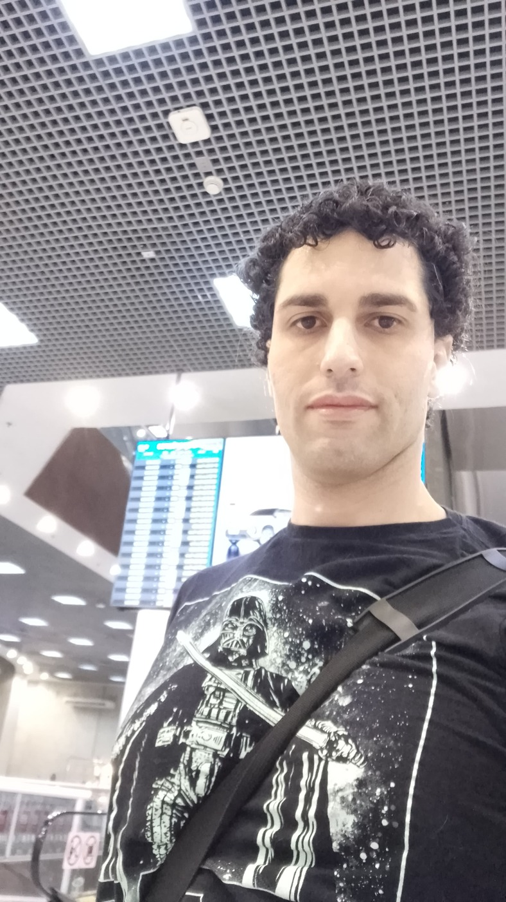

<h1 align="center">👋 Olá! Eu sou Claudio San Roman Rangel</h1>

  <strong>Analista de Infraestrutura Cloud N3 | Especialista em Operações Críticas | DevOps em Evolução</strong> 
  

---

## 🚀 Sobre mim

Profissional com **mais de 15 anos de experiência** em Infraestrutura e Cloud, especializado na administração de ambientes corporativos críticos, redes e segurança. Especialista em sustentação de alta disponibilidade e mitigação de riscos em infraestruturas complexas.

Atualmente focado em **Cultura DevOps**, implementando soluções de IaC (Terraform), Containers (Docker/K8s) e automação de processos via CLI para otimização de custos e escalabilidade.

💼 **Expertise Técnica:**
- **Cloud (AWS & Azure):** VPC/VNet, IAM, EC2, S3, Security Groups e automação via CLI.
- **Infraestrutura como Código (IaC):** Terraform e Ansible.
- **Redes e Segurança:** Fortigate, Cisco, Ativos de Rede e monitoramento avançado com Zabbix.
- **Operações:** Liderança técnica de incidentes e gestão de infraestrutura escalável.

---

## 📂 Projetos em Destaque

### 📌 1. Infra AWS com Terraform
* **📁 Repositório:** [infra-aws-terraform](https://github.com/Claudiosan86/infra-aws-terraform)
* **📝 Descrição:** Provisionamento de infraestrutura escalável na AWS utilizando Terraform.

### ⚡ 2. Pipeline CI/CD com Docker + GitHub Actions
* **📁 Repositório:** [projeto-cicd-docker](https://github.com/Claudiosan86/projeto-cicd-docker)
* **📝 Descrição:** Automação completa do ciclo de vida de uma aplicação containerizada. A esteira realiza o build automático da imagem, autenticação segura via Secrets e push para o Docker Hub a cada commit na branch main.
* **🛠️ Tecnologias:** Docker, GitHub Actions, Docker Hub e Python.
* **✅ Status:** Concluído e validado com ambiente local via `docker run`.

### 🚀 3. Automação de Infraestrutura Efêmera (Azure CLI)
* **📁 Repositório:** [azure-automation-cli](https://github.com/Claudiosan86/azure-automation-cli)
* **📝 Descrição:** Automação completa para provisionamento e destruição de ambientes de Sandbox (VM, VNet, NSG) voltada para times de Dev/QA.
* **✅ Status:** Concluído / Estável (v1.0.0).

---

## 📫 Contato

📧 [claudio.sanroman23@gmail.com](mailto:claudio.sanroman23@gmail.com) | 🔗 [LinkedIn](https://linkedin.com/in/claudio-sanroman-5923417b) | 📱 (21) 99816-84566
